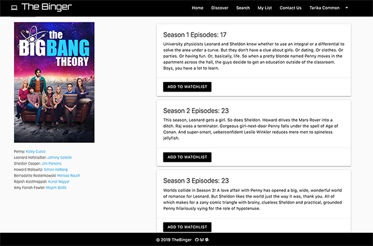
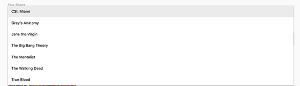

## The Binger :tv:
### From Team: Aggregators - Paul, Rika, Faraah

## Site Usage
Use The Binger to locate your favorite shows, save to a watchlist and check off the epsiodes you have completed. This helps you track the episodes you have watched for all your binge watching needs. 

## Technologies Used
- moment.js
- Materialize
- Firebase
- Jquery
- OMDB API
- Wikipedia
- The Movie DB

## How it works

First page you will see is the log in page. You have to enter in your first and last name and a valid formatted email address.

## Discover Page

After logging in, the first page you will see is the Discover Page. The Discover Page will show "Today's" TV shows that are airing. at 7pm central time, this page updates with the information for the next day. 

## Search Page

On the search page, enter the name of the show that you would like to view.

Once you search a TV show, a list of cards will populate with information of each season. On the left you will find the poster for the TV show plus links to some of the main actor's Wikipedia page.

When you click "Add To Watchlist" the button will change to let you know the season as been added to your Watch List. Whenever you search this show in the future, it will remember which shows you have already saved. 

## My List Page

My List Page will display first the most recently added TV show. You will also see to the left an accordion of the seasons that you added for that show. 

If you have added multiple TV shows, they will populate from the downdown list, you can select whichever show you need from there.

After you click the accordion, each episode will populate. If you click the "3 dots" it will give the description of the episode. If you click the "Watched" buttun. It will remove the episode from the list. If you keep the episode on the page, it may confuse you on what episode is next in your watchlist. Delete it so you don't have to worry about it again. :+1:

## What Do I Do Now?

If you are all done Binging for the day, you make click your name in the top right corner to log out. No worries, when you log back in all your Seasons information will be saved.

## Issue Found

The page is set to not display any foreign language tv shows. ISSUE discovered 5/4/2019. Page is set up to not list shows in foreign language. On Saturday's most of the shows are foreign Because they are not set to appear on page, the page may not flow as intended. 

## The Future

### The Discover Page 

The Discover Page will be updated with the network logo and a link to the official website for the tv show with network. If this is a show you are interested in watching, you can add it to a "Favorites List" or your "Watch List" by clicking the heart.  You may be able to watch a show in "real" time if you have ran out of binging. If its already a saved Season, that episode number will be on your My List Page, just go in to cllick "watched" if you do watch it as it airs.

### TV Show Official Network Trailers

The Youtube API will be used to grab official trailers for the tv shows. There is an option to search by channel, which is normally the name of the network for the official trailers. Some trailers may include separate official channels just for the tv shows.

### Retrieve Watched Episodes

Episodes watched will flow to a different section of the page. This will help if you deleted the wrong episode by mistake. This can be added to a "Favorites List" or from there finally be permanently deleted. For now do not click "watched" on an episode that you have not watched yet!!

:exclamation: You have reached the end. Thank you from Team Aggregators. :tada:

